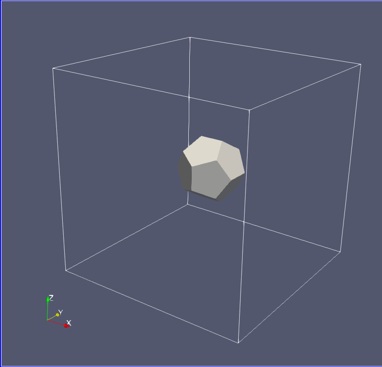
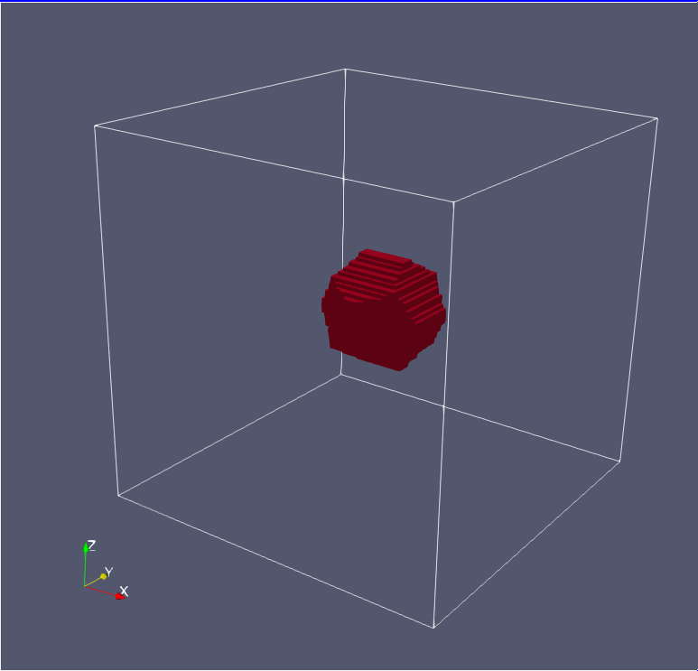
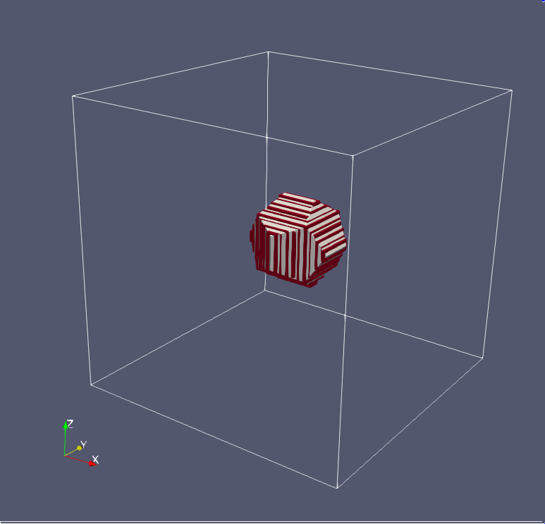
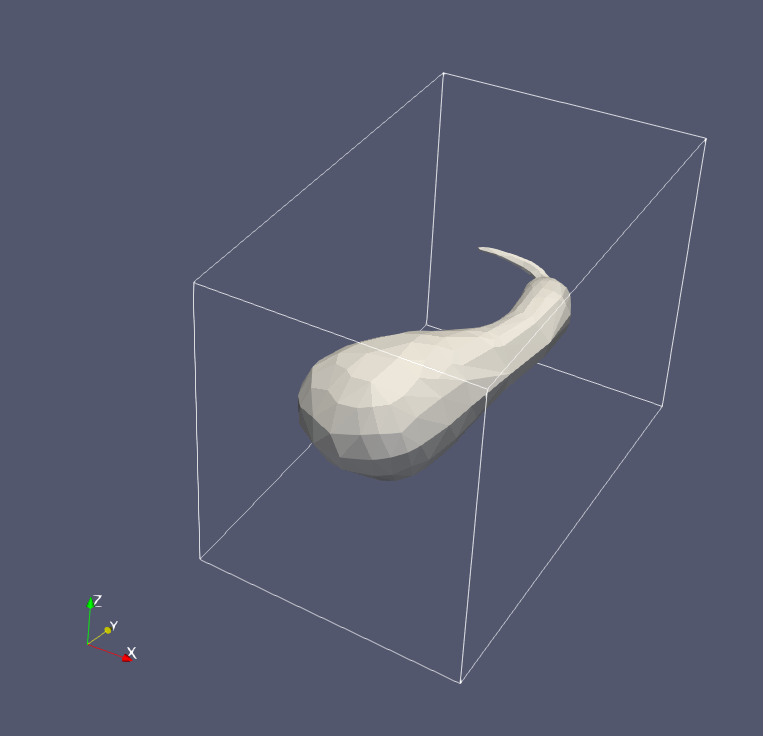
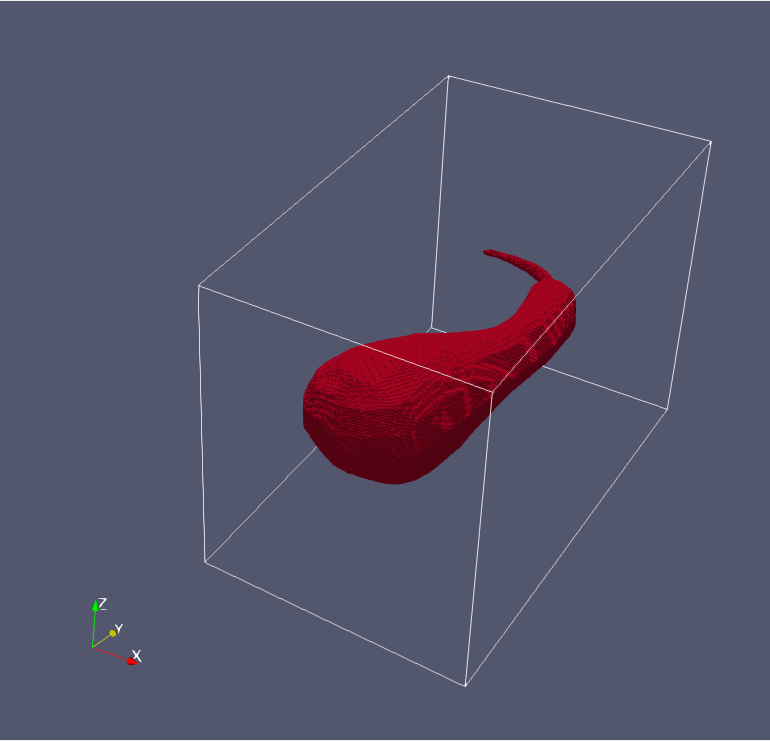
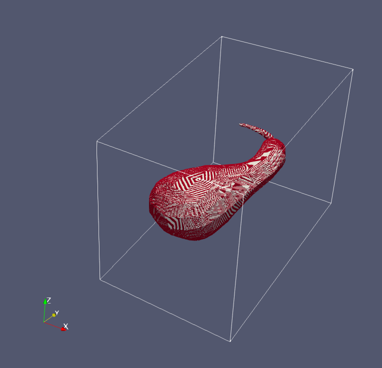
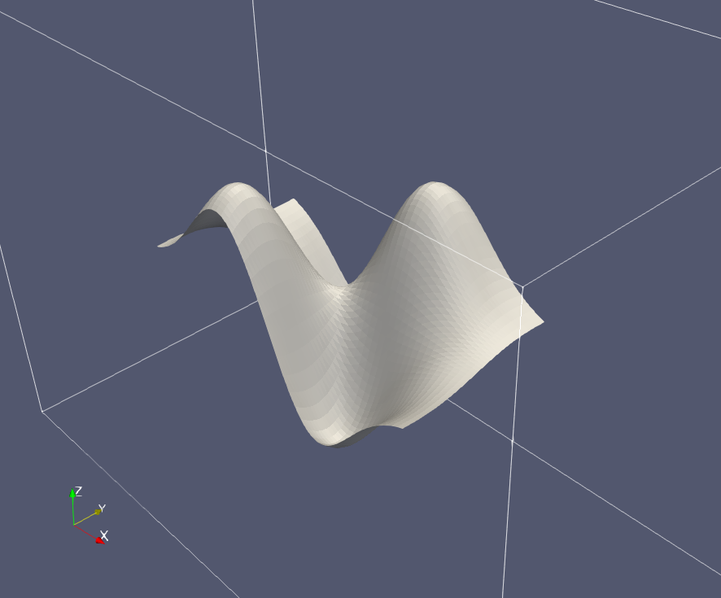
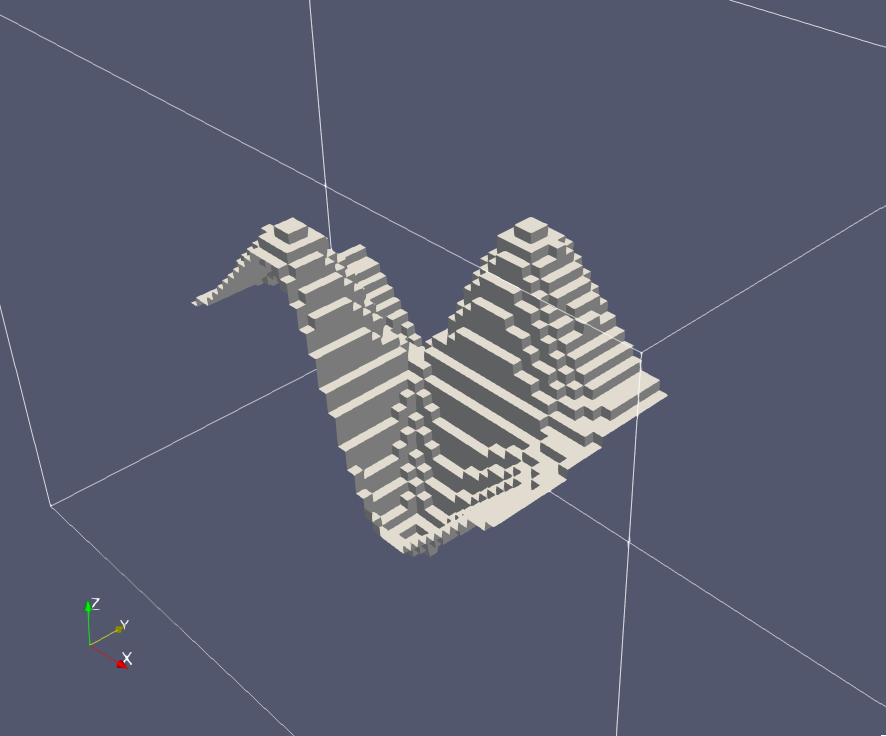
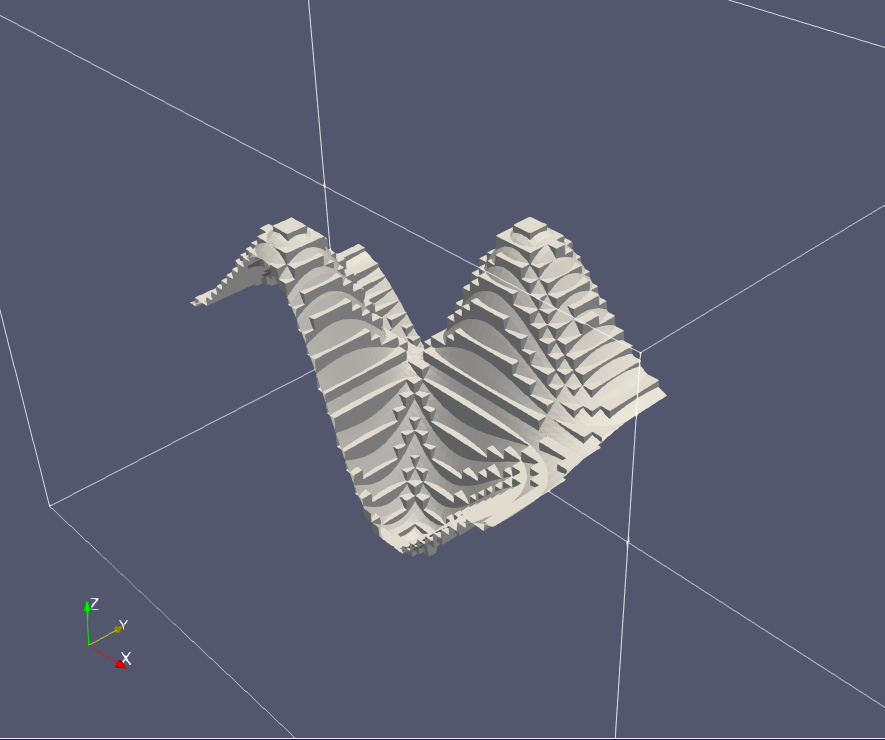

# Summary

The ParFlow Geometry Mapper is a tool for mapping three-dimensional volumes and surfaces onto a ParFlow-style terrain-following grid. 

Mapping algorithms require two inputs: (1) terrain-following grid metadata in json format and (2) a geometry in OBJ format. The OBJ reader only reads vertices and triangular faces. Intersections are identified using the [Möller-Trumbore intersection algorithm](https://en.wikipedia.org/wiki/M%C3%B6ller%E2%80%93Trumbore_intersection_algorithm), which has been modified to work with line segments instead of rays. For performance, an [R-tree](https://en.wikipedia.org/wiki/R-tree) structure is used to query triangles of interest for each potential intersection.

For volumes, the output is a ParFlow binary file containing 1s and 0s, where 1s mark cell centers that are  within the input geometry. For surfaces, the outputs are three ParFlow binary files (x, y, and z directions) in the format required for flow barriers in ParFlow. For convenience, a TCL script to build a VTK draped on a DEM is output for volumes. For surfaces, an OBJ is output showing approximate face locations of flow barriers. The output OBJ format does not average elevations between cells and may not line up exactly with grids produced by other tools.

pfgm.py only processes one geometry at a time. This is intended to make the interface as simple as possible. If multiple geometries are being incorporated into one model grid, each geometry should be processed seperately and indicators can be merged using *read_pfb* and *write_pfb* from pftools. See the relevant section of the [ParFlow documentation](https://parflow.readthedocs.io/en/latest/python/tutorials/pfb.html#creating-pfb-from-python) for details.

# Examples

Sample OBJ files for dodecahedron and gourd examples were obtained from [https://people.sc.fsu.edu/~jburkardt/data/obj/obj.html](https://people.sc.fsu.edu/~jburkardt/data/obj/obj.html)

## Dodecahedron
Sample volume mapping of a dodecahedron containing 36 triangular faces onto a model grid of 1,000,000 cells

`
$ cd examples/dodecahedron && python3 ../../src/pfgm.py -kind volume -tfg tfg.json -obj dodecahedron.obj -o dodecahedron && cd ../..
`

## Gourd
Sample volume mapping of a gourd shape containing 648 faces onto a model grid of 36,331,001 cells. DEM is sloped from ymax to ymin. The intentionally large model grid is intended to test the performance of pfgm.py. The example completes in approximately 20 minutes on modest hardware.  

Run example with

`
$ cd examples/gourd && python3 ../../src/pfgm.py -kind volume -tfg tfg.json -obj gourd.obj -o gourd && cd ../..
`

## Wavy
Sample surface mapping with 4,802 faces onto a model grid with 199,260 cells. The surface is a synthetically-generated geometry based on a (somewhat) arbitrary function: 

$$\frac{7xy}{e^{x^2+y^2}}$$

Run example with

`
cd examples/wavy && python3 ../../src/pfgm.py -kind surface -tfg tfg.json -obj wavy.obj -o wavy && cd ../..
`

# LICENSE

This repository is under the MIT license. Dependencies may be under other licenses.

THE SOFTWARE IS PROVIDED “AS IS”, WITHOUT WARRANTY OF ANY KIND, EXPRESS OR IMPLIED, INCLUDING BUT NOT LIMITED TO THE WARRANTIES OF MERCHANTABILITY, FITNESS FOR A PARTICULAR PURPOSE AND NONINFRINGEMENT. IN NO EVENT SHALL THE AUTHORS OR COPYRIGHT HOLDERS BE LIABLE FOR ANY CLAIM, DAMAGES OR OTHER LIABILITY, WHETHER IN AN ACTION OF CONTRACT, TORT OR OTHERWISE, ARISING FROM, OUT OF OR IN CONNECTION WITH THE SOFTWARE OR THE USE OR OTHER DEALINGS IN THE SOFTWARE.
